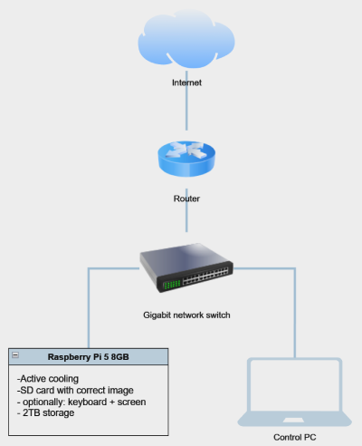

The following section provides a step-by-step guide for configuring, deploying, and running a full Ethereum Node hosted on a single Raspberry Pi device. While a Raspberry Pi 5 is recommended for optimal performance, a Raspberry Pi 4 and Compute Module 4 (CM4) can also be used.

⚠️ To avoid errors during the first setup, please follow the instructions precisely. ⚠️


### Hardware requirements

=== "Raspberry Pi 5"

    - 1 x [Raspberry Pi 5 (8GB)](https://botland.store/raspberry-pi-5-modules-and-kits/23905-raspberry-pi-5-8gb-5056561803326.html) with [Active cooling](https://botland.com.pl/elementy-montazowe-raspberry-pi-5/23925-raspberry-pi-active-cooler-aktywne-chlodzenie-radiator-wentylator-do-raspberry-pi-5-5056561803357.html)
    - 1 x 2TB SSD drive (external USB SSD or NVMe m.2 with adapter) - [recommended storage](../Hardware/storage.md)
    - 1 x SD Card reader/writer 
    - 1 x [microSD Card](../Hardware/microSD.md)
    - 1 x [Power supply](https://botland.store/raspberry-pi-5-power-supply/23907-raspberry-pi-27w-usb-c-power-supply-official-51v-5a-psu-for-raspberry-pi-5-black-5056561803418.html)

    #### Cooling
    [Active cooling](https://botland.com.pl/elementy-montazowe-raspberry-pi-5/23925-raspberry-pi-active-cooler-aktywne-chlodzenie-radiator-wentylator-do-raspberry-pi-5-5056561803357.html) is required to avoid throttling and keep sufficient performance/stability on the system.

    #### Storage
    2 TB fast drive is required. 
    With Raspberry Pi 5 you have three options for storage:

    - external USB SSD drive (wide availability)
    - m.2 NVMe drive with NVMe HAT for Raspberry Pi 5 (max performance)
    - m.2 NVMe drive with USB m.2 adapter 

    Raspberry Pi 5 has a PCIe x1 connector on board so with a special adapter m.2 NVMe drive can be used.
    This option gives the maximum possible performance.
    For more information visit: [recommended storage](/Hardware/microSD/)

    > **If you use USB always choose USB 3.0 ports (blue)**

    #### microSD Card

    Flashing a microSD card takes time, but it can be reduced by using a fast device. Additionally, using a fast micro SD card results in a shorter booting time. A few examples:

    - [Silicon Power 3D NAND](https://www.tomshardware.com/best-picks/raspberry-pi-microsd-cards#section-best-microsd-card-overall)
    - [SanDisk Extreme Pro](https://www.tomshardware.com/best-picks/raspberry-pi-microsd-cards#section-great-speeds-best-for-pi-3)
    - [Kingston Canvas React](https://www.tomshardware.com/best-picks/raspberry-pi-microsd-cards#section-fastest-booting-raspberry-pi-microsd)

    !!! note "More information"
        [https://www.tomshardware.com/best-picks/raspberry-pi-microsd-cards](https://www.tomshardware.com/best-picks/raspberry-pi-microsd-cards).

    #### Power supply
    As a power supply, we recommend an [official PSU 5,1V / 5A](https://botland.store/raspberry-pi-5-power-supply/23907-raspberry-pi-27w-usb-c-power-supply-official-51v-5a-psu-for-raspberry-pi-5-black-5056561803418.html) for Raspberry Pi 5.
    Raspberry Pi 5 + 2TB drive can use a significant amount of power so a sufficient power supply is important for stability.


=== "Raspberry Pi 4"

    - 1 x [Raspberry Pi 4 (8GB)](https://botland.store/raspberry-pi-4b-modules-and-kits/16579-raspberry-pi-4-model-b-wifi-dualband-bluetooth-8gb-ram-18ghz-5056561800356.html) with [Active cooling](https://botland.store/raspberry-pi-4b-cases/15106-case-justpi-for-raspberry-pi-4b-aluminum-with-dual-fan-black-lt-4b02-5903351242660.html)
    - 1 x 2TB SSD drive (external USB SSD or NVMe with m.2 to USB adapter) - [recommended storage](../Hardware/storage.md)
    - 1 x SD Card reader/writer 
    - 1 x [microSD Card](../Hardware/microSD.md)
    - 1 x [Power supply](https://botland.store/raspberry-pi-4b-power-supply/14348-power-supply-for-raspberry-pi-4-usb-c-51v-3a-original-black-644824914886.html)

    #### Cooling
    [Active cooling](https://botland.store/raspberry-pi-4b-cases/15106-case-justpi-for-raspberry-pi-4b-aluminum-with-dual-fan-black-lt-4b02-5903351242660.html) is required to avoid throttling and keep sufficient performance/stability on the system.

    #### Storage
    2 TB fast drive is required. 
    With Raspberry Pi 4 you have two options for storage:

    - external USB SSD drive (wide availability)
    - m.2 NVMe drive with USB m.2 adapter 

    > **If you use USB always choose USB 3.0 ports (blue)**

    #### microSD Card

    Flashing a microSD card takes time, but it can be reduced by using a fast device. Additionally, using a fast micro SD card results in a shorter booting time. A few examples:

    - [Silicon Power 3D NAND](https://www.tomshardware.com/best-picks/raspberry-pi-microsd-cards#section-best-microsd-card-overall)
    - [SanDisk Extreme Pro](https://www.tomshardware.com/best-picks/raspberry-pi-microsd-cards#section-great-speeds-best-for-pi-3)
    - [Kingston Canvas React](https://www.tomshardware.com/best-picks/raspberry-pi-microsd-cards#section-fastest-booting-raspberry-pi-microsd)

    !!! note "More information"
        [https://www.tomshardware.com/best-picks/raspberry-pi-microsd-cards](https://www.tomshardware.com/best-picks/raspberry-pi-microsd-cards).

    #### Power supply
    As a power supply, we recommend an [official PSU 5,1V / 3A](https://botland.store/raspberry-pi-4b-power-supply/14348-power-supply-for-raspberry-pi-4-usb-c-51v-3a-original-black-644824914886.html) for Raspberry Pi 4.
    Raspberry Pi 4 + 2TB drive can use a significant amount of power so a sufficient power supply is important for stability.


=== "Raspberry Pi CM4"

    CM4 module needs carier board. There are many on the market. Minimum requiments are:

    - 1 x Raspberry Pi CM4 (8GB) with Active cooling
    - 1 x 2TB fast storage - [recommended storage](../Hardware/storage.md)
    - 1 x Power supply
    - 16GB+ storage for operating system (microSD or eMMC)


## Hardware Connection

After gathering all the necessary hardware, unbox the Raspberry Pi device and connect it as specified below:

### Connection Diagram



### Photos

The following photos illustrate an example setup:

#### Sample configuration with USB drive


#### Sample configuration with NVMe drive


## OS Images

The image contains a preconfigured Linux distribution capable of running an **Ethereum Node**.

### Prerequisites
To write an image on an SD card, it is recommended to use the official tool provided by the Raspberry Pi Foundation:

- [Raspberry Pi Imager](https://www.raspberrypi.com/software/)

After installing it on your PC, you can download the newest **Web3Pi** image. This image will be used on each device, so only one copy is required:

- [Web3Pi image for Raspberry Pi](../downloads.md)


### Writing Images
Follow the instructions below to write images on a microSD card.

- Insert a blank SD Card into a card reader and connect the reader to your PC
- Open the Raspberry Pi Imager on your PC
- Choose device type
- Choose the downloaded image as a source image
- Choose the SD card reader as a target device
- Required custom configuration
  - Set hostname to _eop-1_
  - Enable SSH authentication
  - Set username and password (e.g., _raspberry/raspberry_)
  - Uncheck "Eject media when finished"
- Write the image to the SD card
- Eject the card and insert it into the device
- Do not omit verify step

!!! note "Remember the hostname" 
    We use mDNS, allowing users to connect to Raspberry Pi with the hostname instead of the IP address after proper installation.
    
    ``` sh
    eop-1.local
    
    ```

An example screenshot with settings for the geth node:


_If some steps remain unclear, you can visit the [Raspberry Pi "getting started" page](https://www.raspberrypi.com/documentation/computers/getting-started.html) for more information on Image settings and usage._


## Initial configuration

Web3Pi image uses classic /boot/firmware/config.txt as config file. This allows you to customize your setup before the first run. After writing the image to the SD card you should see a new drive in your PC. There is a config.txt file. This config is for Raspberry Pi but Web3Pi adds its own sections to it.

``` sh
# Web3Pi config
[web3pi]
geth=true
nimbus=true
lighthouse=false

# Monitoring
influxdb=true
grafana=true
bsm=true
bnm=true
```


<!-- !!! note "More information about config file"
    [config_txt.md](../Advanced/config_txt.md) -->

Here you can choose which services will automatically start during boot.

**true** = service enable  
**false** = service disable  
other value or no value = no change

It is recommended to always leave  bsm=true

!!! tip "Lighthous vs. Nimbus"

    Nimbus needs less resources so it is ideal for devices like Raspberry Pi


## Installation

The Raspberry Pi device will be configured during the initial run, and their software will be updated. 
After this step, devices can be used to host an **Ethereum Node**.


### Warning
⚠️ **In most cases, the installation script erases the SSD content.** ⚠️


### Checklist before the installation
- Make sure that the device is configured correctly (i.e., it has a valid active cooling system installed)
- Make sure that you use the correct SSD (2TB or more)
- Internet access is required (default DHCP)

The SSD contents will not be erased if you have already configured **Web3Pi** using this SSD. However, to force the installer to erase the configured disk, connect it to any device that you can access and follow these commands:
```bash
cd /home/ethereum
touch .format_me
```
The installer will forcefully erase the SSD if the file _.format\_me_ exists in the `/home/ethereum` directory.


### Installation
- Insert the previously prepared SD card into the device
- Connect the SSD to the USB 3.0 port or use NVMe m.2 drive with PCIe adapter
- Connect the Ethernet cable to the device
- Optionally: connect HDMI cable to the monitor and the device using HDMI 0 port (on the device)
- Connect the Raspberry Pi 5 power supply to the device

After the device is powered up, it will enter the process of updating the software and configuring itself to act as an **Ethereum Node**.

!!! Info 

    This process can take up to **15 minutes**.


### Installation verification

Check installation progress by opening 
[http://eop-1.local:7197/node/system/status](http://eop-1.local:7197/node/system/status)

When the installation is completed you will see JSON like this:
``` sh
{"host_name": "eos-1", "num_cores": 4, "cpu_percent": 14.9, "mem_total": 8324055040, "mem_used": 6542295040, "mem_free": 503726080, "mem_percent": 81.8, "swap_total": 0, "swap_used": 4642058240, "swap_free": 12537806848, "swap_percent": 27.0, "disk_used": 1207331737600}
```

If the site is not available, **please wait and try again**.

!!! note "mDNS"
    mDNS service needs some time to start.  
    Raspberry Pi over IP address will be accessible quicker than using host name "eop-1.local"   
    mDNS should be available in less than 15 min from the start. 


#### Grafana Monitoring verification

Open Grafana dashboard: [http://eop-1.local:3000](http://eop-1.local:3000)

Default login and password is: `admin`
You need to change it during first login.

Go to `Dashboards` menu and then to `Ethereum Nodes Monitor` panel.

=== "Sync just started"

    Grafana dashboard/Sync just started 
    
    

=== "Sync in progress"

    Grafana dashboard/Sync in progress
    

=== "Sync completed"

    Grafana dashboard/Sync completed 
    


#### Account verification
- SSH login into the device as _ethereum/ethereum_

!!! note 
    - If the _ethereum_ user does not exist, it means that the installation failed unexpectedly (in such case, _contact the support_) 
    - By default, _ethereum_ user is forced to change the password during the first login

#### Network configuration verification
- From Raspberry Pi device run the command:
  ```bash
  ping -c 4 google.com
  ```
  ```bash
  PING google.com (142.250.186.206) 56(84) bytes of data.
  64 bytes from waw07s05-in-f14.1e100.net (142.250.186.206): icmp_seq=1 ttl=59 time=2.83 ms
  64 bytes from waw07s05-in-f14.1e100.net (142.250.186.206): icmp_seq=2 ttl=59 time=3.62 ms
  64 bytes from waw07s05-in-f14.1e100.net (142.250.186.206): icmp_seq=3 ttl=59 time=2.23 ms
  64 bytes from waw07s05-in-f14.1e100.net (142.250.186.206): icmp_seq=4 ttl=59 time=3.73 ms
 
  --- google.com ping statistics ---
  4 packets transmitted, 4 received, 0% packet loss, time 3005ms
  rtt min/avg/max/mdev = 2.229/3.102/3.734/0.614 ms
  ```

### Summary
At this point, the device is configured and ready to host an **Ethereum Node**.

If you have default config.txt Geth, Nimbus and monitoring software will start automatically as a service.

For more information on configuring or modifying elements of Web3Pi installation, please read the [Advance Settings](/Advanced/Networking/) section of this documentation.

