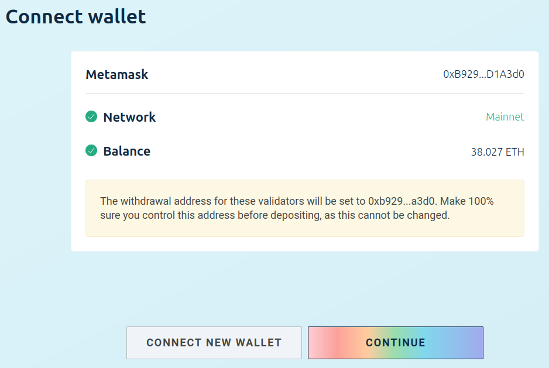
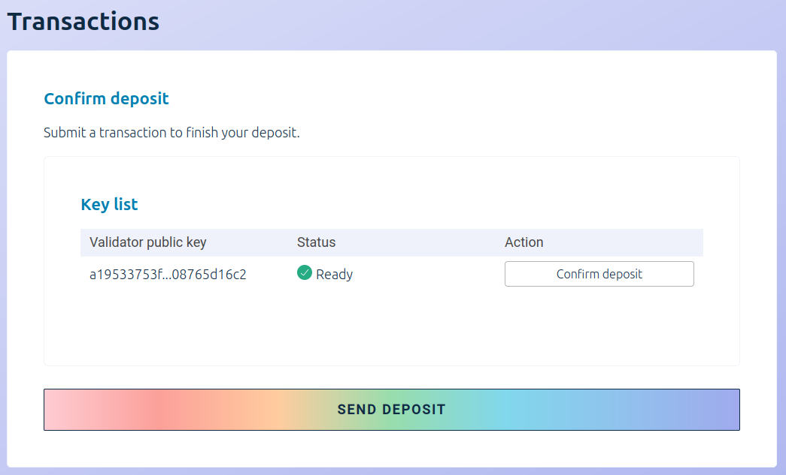

Solo Staking is the most straightforward way to realize profit from the Ether (ETH tokens) you own.
At minimum, it only requires you to deposit 32 ETH into an official staking deposit smart contract
and to run a validator on your full Ethereum node, while ensuring the node stays connected 
to the Internet.

By running your validator on the Ethereum mainnet, you become part of the most crucial component 
of the Ethereum ecosystem - the layer which maintains the consensus of the blockchain, 
and therefore ensures its resilience against attacks.

While helping secure the Ethereum mainnet by validating the transaction blocks, you gain
a small reward every epoch (approximately 6 minutes) as long as your validator is able to sign and 
send the required attestation in time for it to be included in the chain.

## Solo staking on Web3 Pi

Web3 Pi provides all the necessary components required to allow you to start staking on the Ethereum
mainnet. It runs both the execution layer client (`geth`) and the consensus layer client (`nimbus`).
Once it's set-up and the clients are synchronized, the only remaining steps are creation of the
staking deposit keys, depositing the Ether tokens and adding the created keys to your consensus
layer client.

The good news is that you're not even limited to a single validator and a single 32 ETH stake. 
Even if you'd like to stake larger amounts, our tests have shown it should be possible to run
as many validators as you require on a single Raspberry Pi 5.

In this guide we'll show you how easy it is.

### Prerequisites

* 32 Ether
* a fully-synced node
* Metamask installed and paired with the wallet you wish to stake ETH from

Also, while we enumerate all the critical steps, needed to start staking with Web3 Pi,
ultimately, it's your Ether, your wallet and your node. Therefore, you are still responsible for 
your own education on this matter, to ensure you take all the necessary precautions to keep your
wallet, the tokens and your validator keys safe and secure. While following the steps, please
don't skip any recommended reading or cut corners when asked for actions that aim to make the
process safe. 

Moreover, as we don't intend for this guide to be exhaustive source of information.
If you're uncertain about any aspect of running your own Ethereum node,
staking ether or anything else we're about to discuss, by all means, we encourage you to do 
your own research.

### Create the deposit

#### 1. Go to https://launchpad.ethereum.org/

Visit https://launchpad.ethereum.org/ and click on "Become a validator".


#### 2. Proceed through the advisories checklist

Make sure to read all the contents carefully before proceeding through each step.
Don't skip anything unless you're absolutely sure what each step entails.


#### 3. Choose your clients

The launchpad is aimed at a general user and there are various considerations for choosing
specific execution and consensus layer clients. Due to mechanics of the global staking ecosystem,
to strengthen the network and limit the impact of potential attacks, it's generally recommended 
to choose a minority client.

However, while the above is true, and while the launchpad enables you to choose any
of the available clients, the default, battle-tested configuration for the Web3 Pi 
includes `geth` and `nimbus` specifically. 

We have devoted a considerable effort to finding the setup that's optimally suited to
the characteristics of a such a small-footprint device as Raspberry Pi 5 and 
this is the pair of clients which we both recommend and, by extension, include 
in our default Web3 Pi image.

So, unless you're sure you wish to choose differently, and are willing to reconfigure
the device, this is the pair that you should also choose.


#### 4. Generate key pairs

Now you're ready to generate the key pairs, which control your Ether stake and which 
bind the stake to a given validator. 

##### Security considerations

We cannot stress enough how important it is to execute this step in a secure manner.
Given that once you submit your deposit, your validator keys are directly bound to 
your stake, an attacker with malicious intent and in possession of these keys, can,
in the least cause you to lose your staking rewards, and at most, even trigger
a complete loss of your stake through slashing.

That's why, once you download and install the chosen key generator tool, 
it is recommended to run it on a machine that's disconnected from the network.

Please also ensure you keep your mnemonic phrase safe and out of reach of anybody but you.
This is the only way to regenerate your validator key if it gets lost.

##### Provide the withdrawal address 

We strongly recommend setting the withdrawal key right away when generating the validator keys.
Although it is optional and can be performed later on, it can also be performed only once.
Setting it at this stage ensures that even if an attacker were to take control of your validator
keys, they will never be able to override the address to which your stake and the rewards are withdrawn.


##### Generate the keys

Once you fill in the number of validators and the withdrawal address, you proceed with the key
generation itself. You're free to choose whichever tool suits you best, 
depending on your platform and preferences. 
For the sake of this guide, we'll use the CLI app as the example.


In case of the CLI app, the Launchpad gives you the exact command that you should run in your 
terminal. While you proceed, you'll be asked to provide the password to encrypt the keystore file
and will receive the mnemonic phrase which can be used to recover the key.

As mentioned previously, it is critical that you keep these mnemonics safe and private.


#### 5. Upload your deposit data

After the key generator succeeds, you need to upload the just-generated `deposit_data-xxxxxx.json`
file to the Launchpad, so that it can prepare the deposit transaction for you.


Once you upload that file and click continue, the last remaining step is to submit your ETH stake to
the deposit contract.

#### 6. Confirm the deposit

In order to do that, the Launchpad will use your MetaMask wallet to generate and send the
deposit transaction.



Please double-check the withdrawal address and then proceed with the checklist and afterwards, with the 
confirmation of the deposit transaction.



After the transaction is sent and processed by the blockchain, you'll get the final confirmation
that the deposit has been made.


You also get the link to the status website which lists all the active validators, and which
allows you to get the status of your validator. Please note though, that the status for your validator 
may not be immediately visible, and you may need to wait a few minutes until your stake is detected 
by the website.

On successful submission and detection of the deposit, your validator status will appear as "Deposited".


### Add your validator key to your Web3 Pi node

Please note that it takes **several more hours** after you submit your deposit, before your
validator key is added to the pool of active validators.

This doesn't mean that you should wait until that time before proceeding. On the contrary,
you should add the validator keys to the consensus client as soon as possible so that it
is ready before the time comes for it to start submitting attestations. 

That's because the moment the validator is added to the pool, it either starts getting attestation
rewards - or - it starts getting penalized for not taking part in the attestation process.

#### 1. Copy your validator key to your Web3 Pi node

Starting at the local directory, which you generated the validator keys from, execute the following
commands (of course, replacing `your-node` with the actual hostname of your Web3 Pi node):

```bash
ssh ethereum@aopi5.local mkdir validator_keys
scp validator_keys/keystore*.json ethereum@your-node.local:validator_keys/
```

#### 2. Import your validator keys into the nimbus

First, log in normally to your Web3 Pi node's shell (`ssh ethereum@your-node.local`) and then,
assuming your keys have been correctly uploaded to the `validator_keys` directory in the previous step,
run:

```bash
nimbus_beacon_node deposits import --data-dir=/home/ethereum/.nimbus/data/shared_mainnet_0
```

You will be asked for your validator key password which you set in the key generator tool and
afterwards, you should receive a message indicating successful import of your keystore file.

#### 3. Restart the nimbus service

Now, the consensus client service must be restarted so that it can load the validator keys.

```bash
sudo systemctl restart w3p_nimbus-beacon
```

You may verify the success of the operation by examining the logs of the nimbus service: 

```bash
sudo journalctl -xefu w3p_nimbus-beacon
```

Look for lines indicating: `Loading validators` and `Local validator attached`.

### That's it!

That's all that you need to do to start staking on a Web3 Pi.

You can continue to check the logs and the status website. Your final confirmation that your
validator is up and processing attestation will be the "Active" status there:


Now, you will gain staking rewards as long as your node remains online and synced, with sufficiently
low network latency for the attestations to be sent in time.

