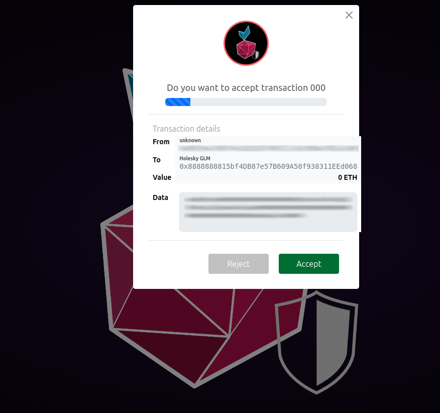

One of the tools we're offering you as part of the Web3-Pi ecosystem is the Transaction Firewall.

This simple tool is designed to increase the security and safety of your interaction with 
the Ethereum blockchain.

It can be used alongside Web3-Pi or as a stand-alone tool. Likewise, it can be run on 
the Web3-Pi device itself, or it can be installed on your own machine and use your 
Web3-Pi's Ethereum node as its gateway.

## Prerequisites

* latest version of Node.js

### Ubuntu

On Ubuntu or any other recent Debian-based Linux distributions, which includes the Web3-pi, 
Node.js can be installed directly the following way:

```bash
sudo apt update
sudo apt install nodejs
sudo apt install npm
```

### Node.js through Node Version Manager

Alternatively, and perhaps optimally, you can install Node.js through its dedicated version
management tool, `nvm` - or - Node Version Manager.

To install `nvm`:

```bash
curl -o- https://raw.githubusercontent.com/nvm-sh/nvm/v0.40.1/install.sh | bash
```

And then, to install and use the latest stable Node.js through `nvm`:

```bash
nvm install --lts
nvm use --lts
```

## Installing the Transaction Firewall

### Clone the repository

Once you have Node.js installed, you can follow up with the installation of
the Transaction Firewall itself. First, clone its repository:

```bash
git clone https://github.com/Web3-Pi/ethereum-transactions-firewall.git && cd ethereum-transactions-firewall
```

### Install the dependencies

```bash
npm install
```

### Create the configuration file

Transaction Firewall is configured through a dotenv (`.env`) file, so you need to create
and fill it with required parameters (here, we're assuming configuration on a Linux machine
using the `nano` editor:

```bash
touch .env
nano .env
```

Sample contents of the configuration file:

```text
node_env=development
server_port=8454
proxy_port=18500
wss_port=18501
rpc_endpoint='http://localhost:8545'
authorized_addr_fn=".auth_addr"
```

Of course, if you're running it on your own machine, put the address of your Web3-Pi node
or any other Ethereum node as the `rpc_endpoint` instead of `localhost`.

### Optional authorized addresses file

You can optionally assign a corresponding label to each authorized address. 
To do this, edit a file .auth_addr, by calling:

```bash
nano .auth_addr
```

and putting the appropriate mapping of contract addresses you'd like to interact with, e.g.:

```text
{
  "0x00000000219ab540356cBB839Cbe05303d7705Fa": "Beacon Deposit Contract",
  "0xC02aaA39b223FE8D0A0e5C4F27eAD9083C756Cc2": "Wrapped Ether",
  "0x7DD9c5Cba05E151C895FDe1CF355C9A1D5DA6429": "GLM Token Contract"
}
```

## Running the Transaction Firewall

The service is configured and ready to run. To start the service, execute the following command 
from the main project directory:

```bash
node index.js
```

On successful startup, the application will print the following (or similar) output:

```text
Websocket server is running on port: 18501
Authorized addresses:
0x00000000219ab540356cBB839Cbe05303d7705Fa: Beacon Deposit Contract
0xC02aaA39b223FE8D0A0e5C4F27eAD9083C756Cc2: Wrapped Ether
0x7DD9c5Cba05E151C895FDe1CF355C9A1D5DA6429: GLM Token Contract
Transaction Firewall Server listening on port: 8454
ValidatingProxy is running: 
  proxy address: http://localhost:18500
  RPC endpoint:  http://localhost:8545
```

To start accepting transactions, open the web browser and connect to the Transaction Firewall 
Server's address.
If you're running the Firewall on your Web3-Pi device, the browser must be opened on 
a machine in the local subnet. 

In the default single-device setup, the device name is configured as `eop-1`, 
and the corresponding webpage is: http://eop-1.local:8454. Of course, if your device has
a different hostname, please use that instead.

You should be greeted with the following screen:


## Using the Transaction Firewall

The firewall acts as a proxy between your wallet software and the Ethereum node.
With regular calls, like e.g. `eth_getBalance`, it just parses the incoming call 
and directly forwards it to the remote RPC endpoint.

To connect to the Transaction Firewall from the wallet or your web3-enabled application,
use the proxy's advertised address - (by default: `http://eop-1.local:18500)

!!! note
    
    Only one web page instance may be opened at a time.
    
    Opening an additional webpage drops the previous connection 
    and redirects all queries to the current one.


### Regular calls

When you issue a call, it will be displayed on the Transaction Firewall's console as:

```text
New request: eth_getBalance -> params : ["0xaaaaaaaaaaaaaaaaaaaaaaaaaaaaaaaaaaaaaaaa","latest"]
```

!!! note

    Although the Transaction Firewall is an asynchronous service, at the moment 
    it serves only one request at a time.

    Requests are not queued, and any new requests sent during acceptance of 
    the previous one are automatically forwarded to the configured RPC endpoint.

### Transactions

After you send a transaction through the Firewall, the transaction won't be
immediately forwarded. Instead, you'll be asked to confirm the transaction
within the Firewall's UI.

If you had added any addresses to your [authorized addresses file](#optional-authorized-addresses-file),
when starting the firewall, any addresses used as the `To` or `From` of the transaction
will be appropriately labeled.



If you decide to reject the transaction, it won't be sent to the remote RPC and an
error will be reported to your wallet software.

On the other hand, should you accept the transaction, or just allow the timeout to
pass, the transaction will be forwarded as just another call.

!!! warning
    
    If the Transaction Firewall web page is not open, the service automatically 
    forwards all requests to the configured RPC endpoint.
