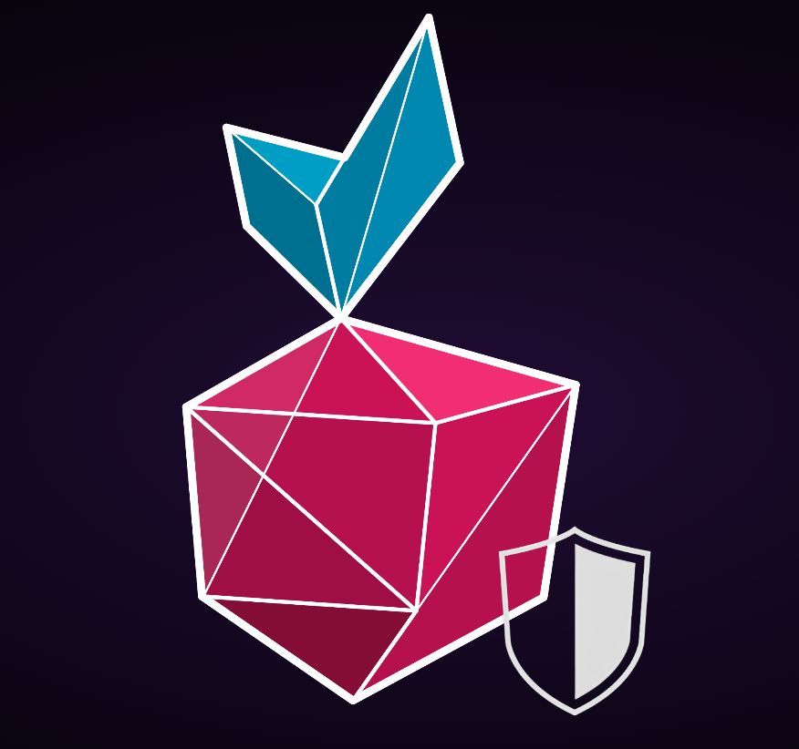

One of the tools offered within the Web3-Pi ecosystem is the Transaction Firewall.

This simple tool is designed to enhance the security of your interactions with 
the Ethereum blockchain.

It can be used alongside Web3-Pi or as a stand-alone tool. Likewise, it can be run on 
the Web3-Pi device itself, or it can be installed on your own machine and use your 
Web3-Pi's Ethereum node as its gateway.

## Prerequisites

* latest version of Node.js

### Ubuntu

On Ubuntu or any other recent Debian-based Linux distributions, which includes the Web3-pi, 
Node.js can be installed directly as follows:

```bash
sudo apt update
sudo apt install nodejs
sudo apt install npm
```

### Node.js through Node Version Manager

Alternatively, and perhaps optimally, you can install Node.js through its dedicated version
management tool, `nvm` - or - Node Version Manager.

To install `nvm`:

```bash
curl -o- https://raw.githubusercontent.com/nvm-sh/nvm/v0.40.1/install.sh | bash
```

And then, to install and use the latest stable Node.js through `nvm`:

```bash
nvm install --lts
nvm use --lts
```

## Installing the Transaction Firewall

### Clone the repository

Once Node.js is installed, proceed with the installation of the Transaction Firewall.
First, clone its repository:

```bash
git clone https://github.com/Web3-Pi/ethereum-transactions-firewall.git && cd ethereum-transactions-firewall
```

### Install the dependencies

```bash
npm install
```

### Create the configuration file

Transaction Firewall is configured through a dotenv (`.env`) file, so you will need to
create it and populate it with the required parameters. 
(here, we're assuming configuration on a Linux machine using the `nano` editor):

```bash
touch .env
nano .env
```

Sample contents of the configuration file:

```text
node_env=development
server_port=8454
proxy_port=18500
wss_port=18501
rpc_endpoint='http://localhost:8545'
authorized_addr_fn=".auth_addr"
known_contracts_fn=".known_contracts"
contract_abis_fn=".contract_abis"
```

Of course, if you're running it on your own machine, put the address of your Web3-Pi node
or any other Ethereum node as the `rpc_endpoint` instead of `localhost`.

### Optional configuration files 

#### Authorized addresses

You can optionally assign a corresponding label to each authorized address. 
To do this, edit a file .auth_addr, by calling:

```bash
nano .auth_addr
```

and putting the appropriate mapping of contract addresses you'd like to interact with, e.g.:

```text
{
  "0xaaaaaaaaaaaaaaaaaaaaaaaaaaaaaaaaaaaaaaaa": "My Address"
}
```

#### Known contracts

Analogously, similar labels can be assigned to select contracts. 
Edit the `.known_contracts` file and add something like:

```text
{
    "0x7DD9c5Cba05E151C895FDe1CF355C9A1D5DA6429": "glm"
}
```

#### Contract ABIs

Finally, you may further enhance the verbosity of the information displayed by the
Firewall in the transaction acceptance UI by providing it with the ABIs of the contracts
you specified as known.

To achieve that, add the `.contract_abis` file with the appropriate ABIs, e.g.:

```text
{
    "glm": [{"constant":true,"inputs":[],"name":"name","outputs":[{"name":"","type":"string"}],"payable":false,"stateMutability":"view","type":"function"},{"constant":false,"inputs":[{"name":"spender","type":"address"},{"name":"amount","type":"uint256"}],"name":"approve","outputs":[{"name":"","type":"bool"}],"payable":false,"stateMutability":"nonpayable","type":"function"},{"constant":true,"inputs":[],"name":"totalSupply","outputs":[{"name":"","type":"uint256"}],"payable":false,"stateMutability":"view","type":"function"},{"constant":false,"inputs":[{"name":"sender","type":"address"},{"name":"recipient","type":"address"},{"name":"amount","type":"uint256"}],"name":"transferFrom","outputs":[{"name":"","type":"bool"}],"payable":false,"stateMutability":"nonpayable","type":"function"},{"constant":true,"inputs":[],"name":"PERMIT_TYPEHASH","outputs":[{"name":"","type":"bytes32"}],"payable":false,"stateMutability":"view","type":"function"},{"constant":true,"inputs":[],"name":"decimals","outputs":[{"name":"","type":"uint8"}],"payable":false,"stateMutability":"view","type":"function"},{"constant":true,"inputs":[],"name":"DOMAIN_SEPARATOR","outputs":[{"name":"","type":"bytes32"}],"payable":false,"stateMutability":"view","type":"function"},{"constant":false,"inputs":[{"name":"spender","type":"address"},{"name":"addedValue","type":"uint256"}],"name":"increaseAllowance","outputs":[{"name":"","type":"bool"}],"payable":false,"stateMutability":"nonpayable","type":"function"},{"constant":false,"inputs":[{"name":"account","type":"address"},{"name":"amount","type":"uint256"}],"name":"mint","outputs":[{"name":"","type":"bool"}],"payable":false,"stateMutability":"nonpayable","type":"function"},{"constant":true,"inputs":[],"name":"version","outputs":[{"name":"","type":"string"}],"payable":false,"stateMutability":"view","type":"function"},{"constant":true,"inputs":[{"name":"account","type":"address"}],"name":"balanceOf","outputs":[{"name":"","type":"uint256"}],"payable":false,"stateMutability":"view","type":"function"},{"constant":true,"inputs":[{"name":"","type":"address"}],"name":"nonces","outputs":[{"name":"","type":"uint256"}],"payable":false,"stateMutability":"view","type":"function"},{"constant":false,"inputs":[{"name":"holder","type":"address"},{"name":"spender","type":"address"},{"name":"nonce","type":"uint256"},{"name":"expiry","type":"uint256"},{"name":"allowed","type":"bool"},{"name":"v","type":"uint8"},{"name":"r","type":"bytes32"},{"name":"s","type":"bytes32"}],"name":"permit","outputs":[],"payable":false,"stateMutability":"nonpayable","type":"function"},{"constant":true,"inputs":[],"name":"symbol","outputs":[{"name":"","type":"string"}],"payable":false,"stateMutability":"view","type":"function"},{"constant":false,"inputs":[{"name":"account","type":"address"}],"name":"addMinter","outputs":[],"payable":false,"stateMutability":"nonpayable","type":"function"},{"constant":false,"inputs":[],"name":"renounceMinter","outputs":[],"payable":false,"stateMutability":"nonpayable","type":"function"},{"constant":false,"inputs":[{"name":"spender","type":"address"},{"name":"subtractedValue","type":"uint256"}],"name":"decreaseAllowance","outputs":[{"name":"","type":"bool"}],"payable":false,"stateMutability":"nonpayable","type":"function"},{"constant":false,"inputs":[{"name":"recipient","type":"address"},{"name":"amount","type":"uint256"}],"name":"transfer","outputs":[{"name":"","type":"bool"}],"payable":false,"stateMutability":"nonpayable","type":"function"},{"constant":true,"inputs":[{"name":"account","type":"address"}],"name":"isMinter","outputs":[{"name":"","type":"bool"}],"payable":false,"stateMutability":"view","type":"function"},{"constant":true,"inputs":[{"name":"owner","type":"address"},{"name":"spender","type":"address"}],"name":"allowance","outputs":[{"name":"","type":"uint256"}],"payable":false,"stateMutability":"view","type":"function"},{"inputs":[{"name":"_migrationAgent","type":"address"},{"name":"_chainId","type":"uint256"}],"payable":false,"stateMutability":"nonpayable","type":"constructor"},{"anonymous":false,"inputs":[{"indexed":true,"name":"account","type":"address"}],"name":"MinterAdded","type":"event"},{"anonymous":false,"inputs":[{"indexed":true,"name":"account","type":"address"}],"name":"MinterRemoved","type":"event"},{"anonymous":false,"inputs":[{"indexed":true,"name":"from","type":"address"},{"indexed":true,"name":"to","type":"address"},{"indexed":false,"name":"value","type":"uint256"}],"name":"Transfer","type":"event"},{"anonymous":false,"inputs":[{"indexed":true,"name":"owner","type":"address"},{"indexed":true,"name":"spender","type":"address"},{"indexed":false,"name":"value","type":"uint256"}],"name":"Approval","type":"event"}]
}
```


## Running the Transaction Firewall

The service is configured and ready to run. To start the service, execute the following command 
from the main project directory:

```bash
node index.js
```

On successful startup, the application will print the following (or similar) output:

```text
04-10-24 08:57:20  Websocket server is running on port: 18501
Authorized addresses:
0xaaaaaaaaaaaaaaaaaaaaaaaaaaaaaaaaaaaaaaaa: my address

Known contracts:
0x7DD9c5Cba05E151C895FDe1CF355C9A1D5DA6429: glm

Contracts with ABIs
glm

04-10-24 08:57:20 Transaction Firewall HTTP Server (to accept/reject transactions) is listening on port: 8454
04-10-24 08:57:20 ValidatingProxy is running: 
04-10-24 08:57:20   proxy address (endpoint to be used in a wallet): http://diziet.local:18500
04-10-24 08:57:20   Ethereum RPC endpoint used by the firewall:      http://aopi5.local:8545
```

To start accepting transactions, open the web browser and connect to the Transaction Firewall 
Server's address.
If you're running the Firewall on your Web3-Pi device, 
ensure that the browser is opened on a machine in the local subnet.

In the default single-device setup, the device name is configured as `eop-1`, 
and the corresponding webpage is: http://eop-1.local:8454. Of course, if your device has
a different hostname, please use that instead.

You should be greeted with the following screen:



## Using the Transaction Firewall

The firewall serves as a proxy between your wallet software and the Ethereum node.
With regular calls, like e.g. `eth_getBalance`, it just parses the incoming call 
and directly forwards it to the remote RPC endpoint.

To connect to the Transaction Firewall from the wallet or your web3-enabled application,
use the proxy's advertised address - (by default: `http://eop-1.local:18500)

!!! note
    
    Only one web page instance may be opened at a time.
    
    Opening an additional webpage drops the previous connection 
    and redirects all queries to the current one.


### Regular calls

When you issue a call, it will be displayed on the Transaction Firewall's console as:

```text
New request: eth_getBalance -> params : ["0xaaaaaaaaaaaaaaaaaaaaaaaaaaaaaaaaaaaaaaaa","latest"]
```

!!! note

    Although the Transaction Firewall is an asynchronous service, at the moment 
    it serves only one request at a time.

    Requests are not queued, and any new requests sent during acceptance of 
    the previous one are automatically forwarded to the configured RPC endpoint.

### Transactions

After you send a transaction through the Firewall, the transaction won't be
immediately forwarded. Instead, you'll be asked to confirm the transaction
within the Firewall's UI.

If you have added any addresses to your [authorized addresses file](#authorized-addresses-file),
when starting the firewall, any addresses used as the `To` or `From` of the transaction
will be appropriately labeled.

Similarly, more details regarding the specific transaction will be displayed if you have
populated the [Known contracts](#known-contracts) and [Contract ABIs](#contract-abis) files.


If you decide to reject the transaction, it won't be sent to the remote RPC and an
error will be reported to your wallet software.

On the other hand, should you accept the transaction, or just allow the timeout to
pass, the transaction will be forwarded as just another call.

!!! warning
    
    If the Transaction Firewall web page is not open, the service automatically 
    forwards all requests to the configured RPC endpoint.

## Using the Transaction Firewall with MetaMask

!!! note
    
    In order for MetaMask to be able to connect to your Web3 Pi node through the Transaction
    Firewall, the configuration of the `geth` client on the Web3 Pi must be updated 
    to accept requests from any domain.

    This is achieved by adding `--http.corsdomain *` 
    to the last line of the script that launches `geth`, namely: 
    `/home/ethereum/clients/geth/geth.sh`.


To use the Transaction Firewall while working with MetaMask, you need to configure
the wallet to use it as its RPC node address.

In order to do that, first click the list of the networks in the upper-left corner
and use the "+ Add Network" button at the bottom of the window.


Then, on the resulting screen, click "Add a network manually". You'll be greeted with the
following screen which, assuming in this case that the Transaction Firewall is running on
your Web3 Pi device, you should fill-in as suggested below:


Once you add the network and set it as default, any operations that you perform in MetaMask,
will be passed through the Transaction Firewall.

