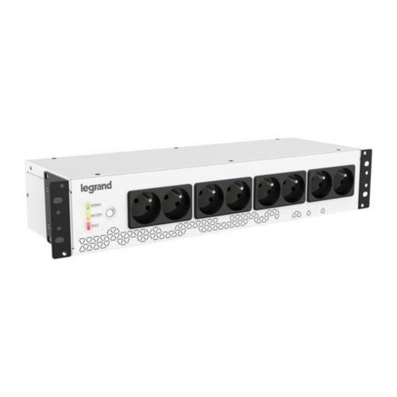
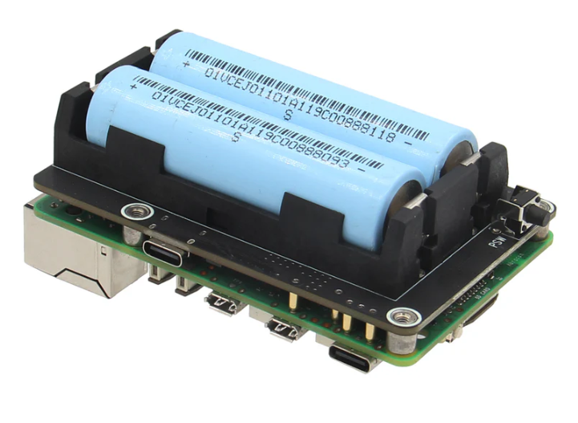
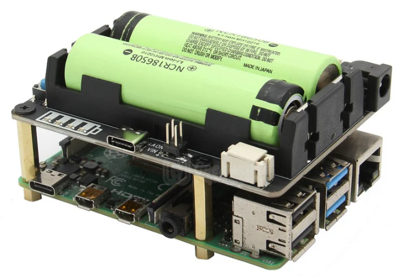

# Power Backup Solutions for Raspberry Pi 5 and Raspberry Pi 4

## Why Use Power Backup for an Ethereum Full Node?

Running a full Ethereum node on Raspberry Pi, especially in projects like **Web3 Pi**, requires consistent and stable power. A power outage or fluctuation can result in corrupted data since the node continuously writes to storage. In addition, even if you live in a region with seemingly stable electricity, brief voltage dips or surges can occur unnoticed, potentially causing instability, freezing, or unexpected reboots of your Raspberry Pi.

For optimal reliability, power backup systems should ideally cover not just the Raspberry Pi but the entire network path (e.g., routers and switches). However, even just powering the Raspberry Pi can significantly enhance stability.

  
  
  

## Backup Power Options for Raspberry Pi

There are two primary solutions for providing backup power to Raspberry Pi:

1. **Conventional 230/110V UPS**
2. **Dedicated UPS for Raspberry Pi SBC**

### Conventional 230/110V UPS

#### Advantages:
- Widely available globally in various models and capacities.
- Can power multiple devices, such as routers, switches, or multiple Raspberry Pis.
  
#### Disadvantages:
- Larger in size and often equipped with fans, which may produce noise.

#### Recommended Model:
- **Legrand UPS KEOR PDU (EAN: 3414971529380)**  
    - Silent operation and tested for reliability.  
    - [More details](https://www.legrand.pl/pl/e-katalog/produkty/ups-keor-pdu-fr8xfr-mont-rack-310330){:target="_blank"}.

### Dedicated Raspberry Pi UPS

#### Advantages:
- Compact and silent.
- Designed specifically for Raspberry Pi, often as a HAT or a small external device.
- Equipped with popular 18650 cells for longer battery life, depending on the number of cells.
- Can interface with Raspberry Pi to detect low battery levels and initiate safe shutdowns.

#### Disadvantages:
- Less commonly available but can be ordered online.

#### Recommendations:

##### For Raspberry Pi 5:
- **[Geekworm X1200 2-Cell 18650 5.1V 5A UPS HAT](https://geekworm.com/products/x1200){:target="_blank"}**  
    - Designed specifically for Raspberry Pi 5.  
    - Features:
        - Supports two 18650 batteries for extended runtime.
        - Output: 5.1V/5A for consistent power delivery.
        - Compact HAT form factor, easy to install.  
    - [More information](https://geekworm.com/products/x1200){:target="_blank"}.

- **[Waveshare UPS Module 3S](https://www.waveshare.com/ups-module-3s.htm?sku=25603){:target="_blank"}**  
    - Features:
        - Supports three 18650 batteries.
        - Smart power management with low-battery alert.
        - Compact external unit, easy to integrate.  
    - [More information](https://www.waveshare.com/ups-module-3s.htm?sku=25603){:target="_blank"}.

##### For Raspberry Pi 4:
- **[Geekworm Raspberry Pi X728](https://geekworm.com/products/x728){:target="_blank"}**  
    - Features:
        - Supports three 18650 batteries.
        - Integrated power management for safe shutdown.
        - Output: 5V/6A.
        - Compact design that mounts directly onto Raspberry Pi.
    - [More information](https://geekworm.com/products/x728){:target="_blank"}.

### Installation and Setup

The installation and configuration processes for these UPS devices are detailed on their respective product pages. Refer to the manufacturer's guides for precise instructions.

### Recommendation

We highly recommend using a power backup solution to enhance the stability of your Ethereum node and reduce potential problems caused by power interruptions.

For Ethereum **Solo Staking**, power backup is critical. A reliable power supply minimizes downtime, ensures data integrity, and helps avoid penalties related to missed attestations or blocks.
