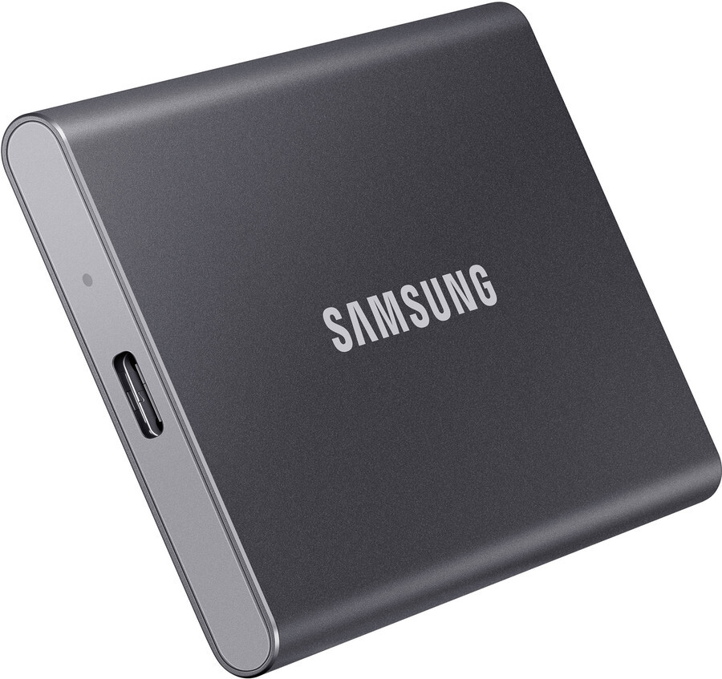
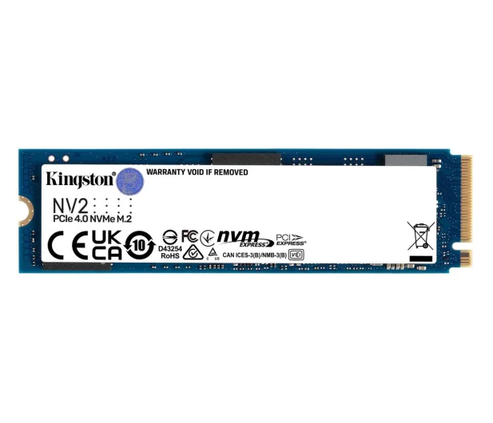

## External USB SSD drive

|                                                                                                 | Brand/Model                 | Comment                                                                                 | Link*                                                                                                                  |
| ----------------------------------------------------------------------------------------------- | --------------------------- | --------------------------------------------------------------------------------------- | ---------------------------------------------------------------------------------------------------------------------- |
| { width="150" }                                            | **Samsung T7 2TB USB 3.2**  | **recommended for most users** compatible with Raspberry Pi 4 and 5                  | [https://tweakers.net/](https://tweakers.net/pricewatch/1560668/samsung-portable-ssd-t7-2tb-grijs/specificaties/)      |

!!! tip "Tip"
    Some external disks consume more power than Raspberry Pi can deliver via USB. 
    For Raspberry Pi 5 max power output of USB ports is 600mA if using a 3A supply, 1600mA if using a 5A supply. 
    You can edit /boot/firmware/config.txt and add usb_max_current_enable=1 to disable current limit.
    This flag is enabled by default in the Web3Pi image.
    Please read the documentation: [https://www.raspberrypi.com/documentation/computers/raspberry-pi.html](https://www.raspberrypi.com/documentation/computers/raspberry-pi.html)

## m.2 NVMe drive
Those drives need adapters

|                                                                        | Brand/Model                      | Controller                    | Comment                                                                                              | Link*                                                                                                                  |
| ---------------------------------------------------------------------- | -------------------------------- | ----------------------------- | ---------------------------------------------------------------------------------------------------- | ---------------------------------------------------------------------------------------------------------------------- |
| { width="150" }               |  **Micron M.2 2230 2TB**         | Silicon Motion SM2269XT    | single side design  ~4 W (Max) small 2230 form factor low power comsumption low heat     | [Product page](https://www.micron.com/products/storage/ssd/client-ssd/2400-ssd)  [More Info](https://www.techpowerup.com/ssd-specs/micron-2400-2-tb.d810)|
| { width="150" }        |  **Sabrent Rocket Q4 2230 2 TB** | Phison PS5021-E21T         | single side design  ~4 W (Max) small 2230 form factor low power comsumption low heat     | [Product page](https://sabrent.com/products/sb-213q-2tb)  [More Info](https://www.techpowerup.com/ssd-specs/sabrent-rocket-q4-2230-2-tb.d1486)|
| { width="150" }             |  **Sabrent Rocket 2280 2TB**     | Phison PS5012-E12S-32      | single side design                                                                                | [Product page](https://sabrent.com/products/sb-rocket-2tb)  [More Info](https://www.techpowerup.com/ssd-specs/sabrent-rocket-2-tb.d1821)|
| { width="150" }            |  **Samsung 980 Pro 2TB**         | Samsung Elpis (S4LV003)    | single side design  7.2 W (Max)                                                                   | [Product page](https://www.samsung.com/pl/memory-storage/nvme-ssd/980-pro-2tb-nvme-pcie-gen-4-mz-v8p2t0bw/)  [More Info](https://www.techpowerup.com/ssd-specs/samsung-980-pro-2-tb.d52)|
| { width="150" }                   |  **Kingston KC3000 2TB**         | Phison PS5018-E18-41       | double side design  10.0 W (Max) high performance wide avability                            | [Product page](https://www.kingston.com/pl/ssd/kc3000-nvme-m2-solid-state-drive)  [More Info](https://www.techpowerup.com/ssd-specs/kingston-kc3000-2-tb.d260)|
| { width="150" }            |  **Crucial P5 Plus 2TB**         | Micron DM02A1              | single side design  8.6 W (Max)                                                                   | [Product page](https://www.crucial.com/products/ssd/crucial-p5-plus-ssd)  [More Info](https://www.techpowerup.com/ssd-specs/crucial-p5-plus-1-tb.d107)|
| { width="150" }                     |  **Crucial P3 2TB**              | Phison PS5021-E21T         | single side design  low cost wide avability                                                    | [Product page](https://www.crucial.com/ssd/p3/ct2000p3ssd8)  [More Info](https://www.techpowerup.com/ssd-specs/crucial-p3-2-tb.d829)|
| { width="150" }                 |  **Kingston NV2 2TB**            | Silicon Motion SM2267XT    | single side design  low cost wide avability                                                    | [Product page](https://www.kingston.com/pl/ssd/nv2-nvme-pcie-ssd)  [More Info](https://www.techpowerup.com/ssd-specs/kingston-nv2-2-tb.d1190)|
| { width="150" }           |  **Teamgroup MP44S 2230 2TB**    | Phison PS5021-E21          | single side design  small 2230 form factor low power comsumption low heat                   | [Product page](https://www.teamgroupinc.com/en/product-detail/ssd/TEAMGROUP/mp44s/mp44s-TM5FF3002T0C101/)  [More Info](https://www.techpowerup.com/ssd-specs/teamgroup-mp44s-2-tb.d1724)|

!!! tip "Tip"
    Double-sided NVMe M.2 memory modules (with memory chips on both sides of the PCB) may not be fully compatible with every adapter due to physical dimensions, specifically the height of the M.2 slot in the adapter/enclosure.

## NVMe HAT for Raspberry Pi 5

|                                                                                                 | Brand/Model                      | Comment                                                                                 | Link*                                                                                                                  |
| ----------------------------------------------------------------------------------------------- | -------------------------------- | --------------------------------------------------------------------------------------- | ---------------------------------------------------------------------------------------------------------------------- |
| { width="150" }                                             |  **Pimoroni NVMe Base**          | tested high quality double side fiendly                                                                  | [Product page](https://shop.pimoroni.com/products/nvme-base?variant=41219587178579)  [Shop](https://botland.store/raspberry-pi-5-gpio-extensions-and-hat/24391-nvme-base-expansion-board-for-raspberry-pi-5-pimoroni-pim699-769894024881.html)|
| { width="150" }                             |  **Raspberry Pi m.2 Hat**        | official tested high quality double side fiendly 2230 and 2242 form factors other form factors can be used, but they require their own mounting and extend beyond the outline| [Product page](https://www.raspberrypi.com/products/m2-hat-plus/)  [Shop](https://botland.store/raspberry-pi-hat-pci-express-overlays/24601-raspberry-pi-m2-hat-for-nvme-drives-and-m2-accessories-for-raspberry-pi-5-5056561803463.html)|
| { width="150" }              |  **Pineboards HatDrive! Bottom** | tested high quality double side fiendly 2230, 2242, 2280 form factor                         | [Product page](https://pineboards.io/products/hatdrive-bottom-2230-2242-2280-for-rpi5)  [Shop](https://botland.store/raspberry-pi-hat-pci-express-overlays/24731-pineboards-hatdrive-bottom-pcle-adapter-for-nvme-2230-2242-2280-for-raspberry-pi-5-5906268918017.html)|
| { width="150" }                    |  **Pineboards HatDrive! Top**    | tested high quality double side fiendly 2230 and 2242 form factors other form factors can be used, but they require their own mounting and extend beyond the outline                                                                 | [Product page](https://pineboards.io/products/hat-top-2230-2240-for-rpi5)  [Shop](https://botland.store/raspberry-pi-hat-pci-express-overlays/24732-pineboards-hatdrive-top-nvme-adapter-2230-2242-for-raspberry-pi-5-5906268918000.html)|
| { width="150" }                                    |  **Waveshare 26583**             | tested high quality double side fiendly 2230 and 2242 form factors other form factors can be used, but they require their own mounting and extend beyond the outline                                                                  | [Product page](https://www.waveshare.com/pcie-to-m.2-hat-plus.htm)  [Shop](https://botland.store/raspberry-pi-hat-pci-express-overlays/24483-pcie-to-m2-adapter-for-raspberry-pi-5-waveshare-26583.html)|
| { width="150" }                                      |  **KAmodRPi5 PCIe-M.2**          | We do **not** recommend it. We had problems with this adapter.  | [Product page/Shop](https://kamami.pl/moduly-komunikacyjne/1188499-kamodrpi5-pcie-m2-adapter-dysku-nvme-m2-dla-raspberry-pi-5-5906623432912.html)|
| { width="150" }                                      |  **Geekworm X1001**              | We do **not** recommend it. The adapter is designed to deliver 1A 5V power. It is not enough for a 2TB NVMe. Poor quality ribbon cable | [Product page/Shop](https://geekworm.com/products/x1001)|

## microSD card

Flashing a microSD card takes time, but it can be reduced by using a fast device. Additionally, using a fast micro SD card results in a shorter booting time.   
The recommended capacity is 32 or 63 GB.

A few examples:

|                                                                                                 | Brand/Model                   | Comment           | Link*                                                                                                                  |
| ----------------------------------------------------------------------------------------------- | ----------------------------- | ----------------- | ---------------------------------------------------------------------------------------------------------------------- |
| { width="150" }                             |  **SanDisk Extreme Pro**      |                   | [Product page](https://www.westerndigital.com/en-ap/products/memory-cards/sandisk-extreme-pro-uhs-i-microsd?sku=SDSQXCU-064G-GN6MA)|
| { width="150" }                                 |  **Samsung EVO Plus**         |                   | [Product page](https://www.samsung.com/pl/memory-storage/memory-card/evo-plus-128gb-microsd-card-2021-mb-mc128ka-eu/)|
| { width="150" }                       |  **Silicon Power 3D NAND**    |                   | [Product page](https://www.silicon-power.com/web/pl/product-Superior_Pro_microSDXC_Colorful)|
| { width="150" }                                       |  **SanDisk Ultra**            |                   | [Product page](https://www.westerndigital.com/en-ap/products/memory-cards/sandisk-ultra-uhs-i-microsd-120-mbps?sku=SDSQUA4-064G-GN6MA)|
| { width="150" }                      |  **SanDisk MAX ENDURANCE**    |                   | [Product page](https://www.westerndigital.com/en-ap/products/memory-cards/sandisk-max-endurance-uhs-i-microsd?sku=SDSQQVR-064G-GN6IA)|
| { width="150" }                   |  **Lexar Professional 1000x** |                   | |

## Enclosures for Raspberry Pi 5

|                                                                             | Brand/Model                  | Comment                                                                                 | Link*                                                                                                                  |
| --------------------------------------------------------------------------- | ---------------------------- | --------------------------------------------------------------------------------------- | ---------------------------------------------------------------------------------------------------------------------- |
| { width="150" }            |  **Argon NEO 5 M.2 NVMe**    | +good cooling +metal -inconvenient access to the microSD card -m.2 slot not comaptible with double side NVMe (easy modification posible with utility knife)   | [Product page](https://argon40.com/products/argon-neo-5-m-2-nvme-for-raspberry-pi-5?_pos=1&_psq=Argon+NEO+5+M.2+NVME+PCIE+Case+for+Raspberry+Pi+5&_ss=e&_v=1.0)  [Shop](https://botland.store/raspberry-pi-5-cases/24397-argon-neo-5-m2-nvme-pcie-case-for-raspberry-pi-5-with-fan-and-heatsink-aluminum-black-860011360049.html)|
| { width="150" }                         |  **Argon NEO 5**             | +easy acces to microSD card +good cooling +metal                                  | [Product page](https://argon40.com/products/argon-neo-case-for-raspberry-pi-5)  [Shop](https://botland.store/raspberry-pi-5-cases/24095-argon-neo-5-bred-case-for-raspberry-pi-5-with-fan-black-and-red-6974297861856.html) |
| { width="150" }         |  **Argon ONE V3 M.2 NVMe**   | +good cooling +metal -m.2 slot not comaptible with double side NVMe (easy modification posible with utility knife)   | [Product page](https://argon40.com/products/argon-one-v3-m-2-nvme-case?_pos=1&_sid=44da22b52&_ss=r)  [Shop](https://botland.store/raspberry-pi-5-cases/24396-argon-one-v3-m2-nvme-pcie-case-for-raspberry-pi-5-with-fan-and-heatsink-aluminum-black-860011360032.html)|
| { width="150" }                     |  **Argon ONE V3**            | +good cooling +metal                                                                 | [Product page](https://argon40.com/products/argon-one-v3-case-for-raspberry-pi-5?_pos=1&_psq=Argon+ONE+V3+Case+for+Raspberry+Pi+5&_ss=e&_v=1.0)  [Shop](https://botland.store/raspberry-pi-5-cases/24395-argon-one-v3-case-for-raspberry-pi-5-with-fan-and-heatsink-aluminum-black-860011360025.html) |

## Enclosures for Raspberry Pi 4B

|                                                              | Brand/Model                 | Comment       | Link*                                                                                                                  |
| ------------------------------------------------------------ | --------------------------- | ------------- | ---------------------------------------------------------------------------------------------------------------------- |
| { width="150" }   |  **Case justPi**            |               | [Product page](https://botland.store/raspberry-pi-4b-cases/15106-case-justpi-for-raspberry-pi-4b-aluminum-with-dual-fan-black-lt-4b02-5903351242660.html)  [Shop](https://botland.store/raspberry-pi-4b-cases/15106-case-justpi-for-raspberry-pi-4b-aluminum-with-dual-fan-black-lt-4b02-5903351242660.html)|
| { width="150" }        |  **Argon One V2**           | Fan control needs additional configuration as described by the manufacturer [manual](https://cdn.shopify.com/s/files/1/0556/1660/2177/files/AR1_PI4-V2_INSTRUCTION_MANUAL_20200922.pdf?v=1646125923)  | [Product page](https://argon40.com/products/argon-one-v2-case-for-raspberry-pi-4)  [Shop](https://botland.store/raspberry-pi-4b-cases/15391-raspberry-pi-4-aluminum-case-with-fan-argon-one-v2-grey-5904422301347.html) |
| { width="150" } |  **Argon One V2 m.2**       | Fan control needs additional configuration as described by the manufacturer [manual](https://cdn.shopify.com/s/files/1/0556/1660/2177/files/AR1_NVME_INSTRUCTION_MANUAL_20220531.pdf?v=1659581194)  | [Product page](https://argon40.com/products/argon-one-m-2-case-for-raspberry-pi-4)  [Shop](https://botland.store/raspberry-pi-4b-cases/17273-raspberry-pi-4-aluminum-case-with-fan-argon-one-m2-grey-5904422328597.html) |

## USB to NVMe adapters

|                                                 | Brand   | Link*                                                                                       |
| ----------------------------------------------- | ------- | ------------------------------------------------------------------------------------------  |
| { width="150" }   | ZenWire | [Product Page](https://zenwire.eu/pl/p/Adapter-SSD-M2-NVMESATA-kieszen-na-dysk-obudowa-M.2-USB-C-10-GBs-Zenwire/289)|
| { width="150" }     | RIITOP  | [Product Page](https://www.riitop.com/collections/msata-ssd-adapter/products/m-2-to-usb-docking-station-riitop-m-2-ssd-to-usb-c-reader-adapter-for-both-m-2-m-key-nvme-ssd-and-b-m-key-sata-based-ssd-1)|
| { width="150" }     | QOLTEC  | [Product Page](https://www.qoltec.com/product/qoltec-enclosure-for-m2-sata-ssd-ngff-usb-type-c)|

or other similar

---
_*Sample links result from a quick Google search mainly for the reader's convenience & quick price reference; we invite you to do your own research and find local hardware providers._

