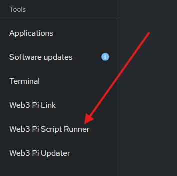

# Script Runner

Script Runner is a Cockpit plugin that provides a user-friendly interface for executing pre-installed scripts on your Web3 Pi. This allows for easy access to common utilities and diagnostic tools directly from the Cockpit web interface.

## Installation

The Script Runner plugin is installed via the "Web3 Pi Updater" section in the Cockpit interface. Search for "Script Runner" and install the plugin. Make sure to refresh the page after the installation is complete. On newer Web3 Pi releases, this plugin might be pre-installed by default.

## Usage

The Script Runner plugin is located in the Cockpit navigation menu. Upon opening, you will see a list of available scripts.

### Running a Script

1.  **Select a Script:** Click on the desired script from the list.
2.  **View Script (Optional):** Click on the "Read File Contents" button to inspect the script's contents.
3.  **Run Script:** Click the "Run" button to execute the script.
4.  **View Output:** The script's output will be displayed in a terminal window within the plugin.

## Troubleshooting

- **Script Execution Errors:** Check the script's output for error messages.
- **Missing Scripts:** If a script is missing, ensure your Web3 Pi installation is up-to-date. Navigate to the "Web3 Pi Updater" section in the Cockpit interface and search for "Script Runner".

## Support

For support and further assistance, join the [Web3 Pi Discord](https://discord.gg/aDMw5zeUZ4) community.
