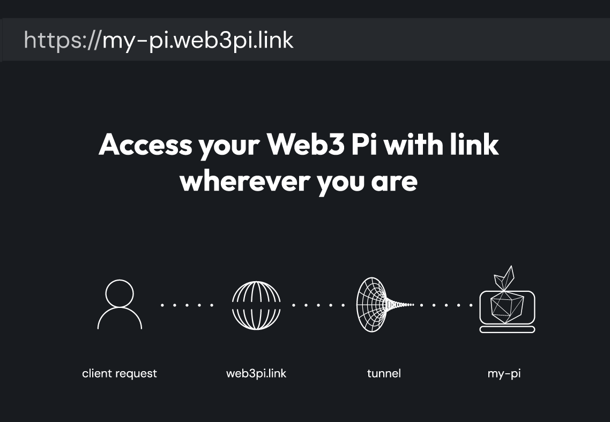
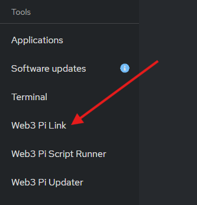
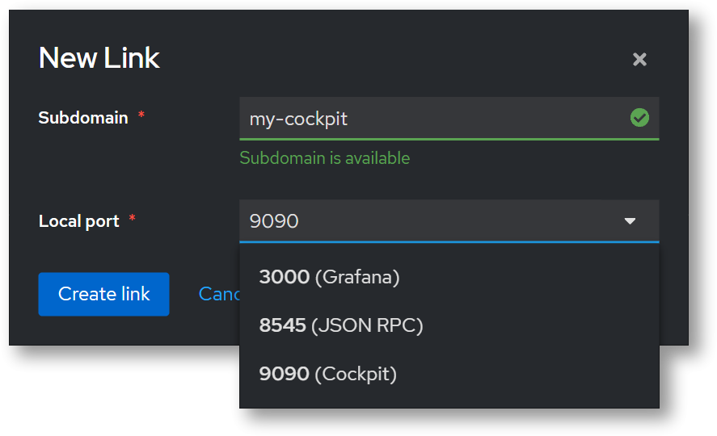

# Web3 Pi Link

Web3 Pi Link is a Cockpit plugin enabling secure exposure of Raspberry Pi services to the internet. It functions as a reverse proxy tunnel, eliminating the need for manual port forwarding. This document provides technical details for developers using Web3 Pi Link.

## Core Functionality

Web3 Pi Link establishes a persistent, encrypted tunnel between your Raspberry Pi and a Web3 Pi managed server. This tunnel allows external access to services running on your Pi without direct exposure or complex network configuration. The plugin manages the tunnel lifecycle and provides a simplified configuration interface within Cockpit.

## Key Features

- **HTTP/WebSocket Proxy:** Supports forwarding HTTP and WebSocket traffic from the Raspberry Pi to a public-facing address. _Note: Other protocols like SSH are currently not supported._
- **Automatic HTTPS:** All tunnels are automatically secured with HTTPS, even if the service on the Raspberry Pi uses HTTP internally.
- **Automatic Reconnection:** The plugin automatically re-establishes the tunnel in case of network interruptions.
- **Cockpit Integration:** Configuration is managed entirely through the Cockpit web interface.
- **Subdomain Routing:** Each service is assigned a unique subdomain (`yourname.web3pi.link`) for easy access.

## Technical Architecture

The plugin creates a reverse proxy tunnel. When a request arrives at `yourname.web3pi.link`, it's routed through the Web3 Pi infrastructure, through the secure tunnel to the specified port on your Raspberry Pi. The tunnel client, running on the Raspberry Pi, establishes an outbound connection to the Web3 Pi servers, so there is no need to open any specific ports on your Pi.

## Installation and Configuration

### Prerequisites

- A Raspberry Pi with Web3 Pi installed and operational.
- Cockpit web interface access.
- Network connectivity allowing outbound connections. _Note: No specific firewall rules are required as the connection is initiated from the Raspberry Pi._

### Installation Steps

1.  **Install via Cockpit:** Access the Cockpit web interface and navigate to the "Web3 Pi Updater" section. Search for "Web3 Pi Link" and install the plugin. Make sure to refresh the page after the installation is complete. Newer Web3 Pi versions may have this plugin already installed by default.

    

2.  **Configuration:** The Web3 Pi Link plugin will appear in the Cockpit navigation.

    - **Local Port:** Specify the TCP port on your Raspberry Pi that you want to expose (e.g., `3000`, `8545`, `9090`). This is the port your HTTP service is listening on.
    - **Subdomain:** Choose a unique subdomain name. This will be used to construct the public-facing URL (`yourname.web3pi.link`). The subdomain must be globally unique. A valid subdomain must begin with a letter or number and can contain lowercase letters, numbers, and hyphens.

## Troubleshooting and Debugging

- **Verify Service Status:** Check that the Web3 Pi Link service is enabled and running. You can do this by navigating to the "Services" section in the Cockpit interface and searching for "web3-pi-link".
- **Network Connectivity:** Ensure the Raspberry Pi has outbound internet access.
- **HTTPS Issues:** While Web3 Pi Link automatically provides HTTPS, ensure your application handles redirects correctly if it expects HTTPS.

## Security Considerations

- **Secure Your Application:** Web3 Pi Link provides a secure tunnel with automatic HTTPS, but it's crucial to secure your application. Implement proper authentication, authorization, and input validation to prevent vulnerabilities.
- **Regular Updates:** Make sure to always keep your Web3 Pi software up to date with the latest security patches. You can download the latest updates to each plugin from the "Web3 Pi Updater" section in the Cockpit interface.
- **Monitor Logs:** Regularly monitor application logs for suspicious activity.

## Support

For support and further assistance, join the [Web3 Pi Discord](https://discord.gg/aDMw5zeUZ4) community.
