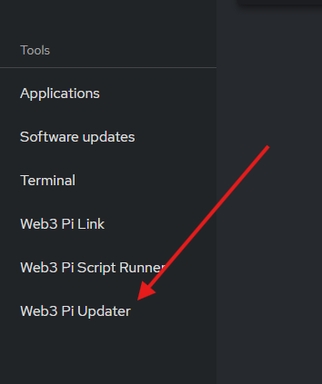
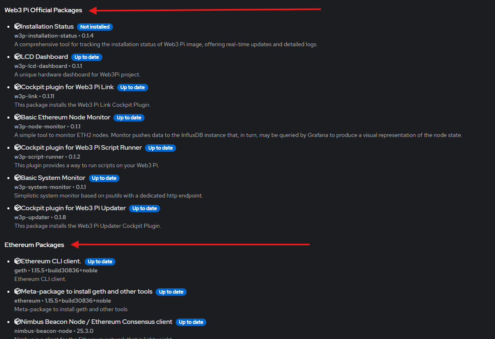
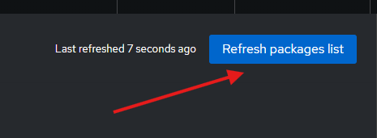

# Web3 Pi Updater

The Web3 Pi Updater plugin provides a centralized interface for managing Web3 Pi packages and essential Ethereum node dependencies. This tool allows you to easily list, update, and install software directly from the Cockpit web interface.

## Usage

The Web3 Pi Updater plugin is located in the Cockpit navigation menu.

### Packages List

Packages are separated into two categories: Web3 Pi Official Packages and Ethereum Packages. The former are maintained by the Web3 Pi team and provide additional functionality for your device, while the latter are maintained by their respective developers and are essential for running a node.

### Refresh Packages List

Web3 Pi packages are distributed from our apt repository. To ensure that your device is up to date with the latest packages, click the **Refresh packages list** button. This will update the list of available packages and give you the option to install or update them.

!!! note

    The **Refresh packages list** button has the same effect as running `sudo apt update` on the command line.

### Install or Update Packages

To install a package, click the **Install** button next to the package name.

To update an existing package, click the **Update** button next to the package name.

!!! note

    After installing a new cockpit plugin, you may need to refresh your browser tab to see the new plugin in the navigation menu.

## Notes

- Package installations and updates may require administrative privileges.
- Ensure your Web3 Pi has a stable internet connection during package operations.
- Regularly check for updates to maintain optimal performance and security.

## Support

For support and further assistance, join the [Web3 Pi Discord](https://discord.gg/aDMw5zeUZ4) community.
